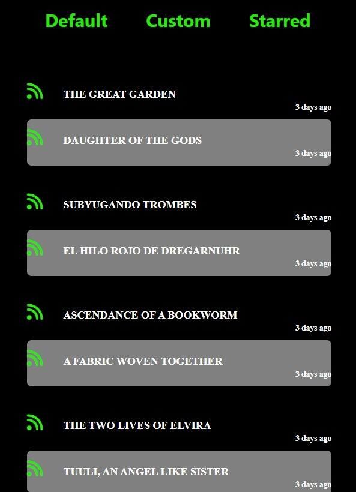

<h3 align="center">AO3 RSS Reader - Web Extension</h3>

  

    A web extension for accessing the RSS feeds of your favourite tags on <a href="https://archiveofourown.org/" target="_blank"> AO3 </a>
  

<!-- ABOUT THE PROJECT -->
## About The Project

</img>

This is a web extension made specifically for the website <a href="https://archiveofourown.org/" target = "_blank"> AO3 </a>, a non-profit website for tranformative works such as fanfiction, fanart, etc. 

You could read their RSS feed on a generic RSS reader found all over the internet, but quickly come across a problem. The feed is sorted by the latest published rather than the latest updated. So if you are reading something published, say, a year ago, you won't see the updates on that feed. You either have to go to the website or subscribe and receive updates through mail, both of which are far less convenient than receiving instant notifications through a web extension.

So that is where our role comes in! Since the RSS also gives information about when a work was last updated, we can create a custom RSS parser to display the latest content and package it as a web extension to make it more accessible.

### Built With

* 
* 
* 
